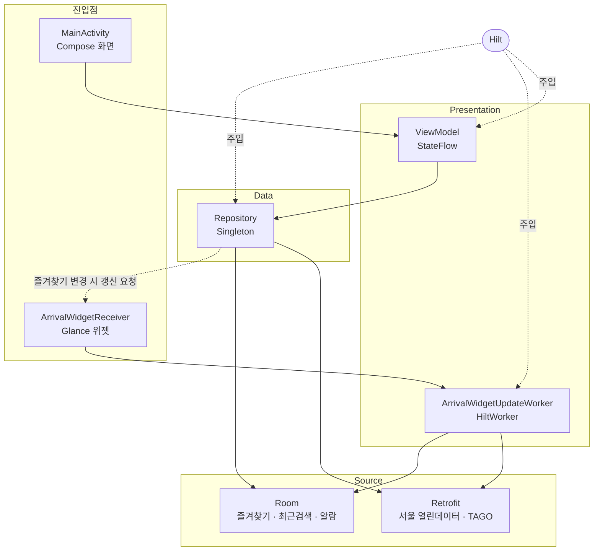

# Ezegot

[](https://github.com/BaekJongHyeok/Ezegot/actions/workflows/android.yml)

서울 지하철 실시간 도착 정보 Android 앱. 즐겨찾기 역의 도착 시간을 홈 화면과 위젯에서 바로 본다.

## 스크린샷

| 홈 | 역 상세 | 전체 시간표 |
|---|---|---|
|  |  |  |
| 즐겨찾기 역의 양방향 도착 시간과 근처 역 | 방향별 도착, 첫차·막차, 환승 노선 | 다음 열차 6편과 시간대별 목록 |

| 검색 | 근처 역 |
|---|---|
|  |  |
| 역 이름 검색과 최근 검색 기록 | 현재 위치 기준 근처 역 지도 |

## 만든 이유

회사에서 지하철 개찰구를 무정차로 통과시키는 측위 SDK를 Java로 개발했다.
게이트 쪽 코드였다. 같은 지하철 도메인을 승객 관점에서 다시 만들어보고 싶었다.

실무 스택은 Java와 MVP였고, Kotlin·Compose·Coroutine을 화면 몇 개짜리 예제가 아니라
실제 API와 백그라운드 갱신이 얽힌 규모에서 다뤄보는 것이 목표였다.

공공 API를 쓰는 앱이라 데이터가 늘 깔끔하게 오지 않는다.
그 응답을 실제로 뜯어보는 과정에서 나온 것들이 이 프로젝트의 대부분이다.

## 주요 기능

- 즐겨찾기 역의 상·하행 도착 시간을 홈에서 한 번에 확인
- 현재 위치 기준 근처 역 목록과 지도 표시
- 역 이름 검색과 최근 검색 기록
- 역 상세: 방향별 도착 정보, 첫차·막차, 하루 전체 시간표, 역 위치
- 열차 도착 N분 전 알림 예약
- 홈 화면 위젯: 즐겨찾기 3개의 양방향 도착 시간, 15분 주기 갱신

## 기술 스택

| 분류 | 사용 | 버전 |
|---|---|---|
| 언어 | Kotlin | 1.9.10 |
| UI | Jetpack Compose, Material3 | Compose BOM 2024.04.01 |
| 화면 이동 | Navigation Compose | 2.7.7 |
| DI | Hilt | 2.51.1 |
| 로컬 DB | Room | 2.6.1 |
| 네트워크 | Retrofit, OkHttp, SimpleXML, Gson | 2.9.0 / 4.12.0 |
| 비동기 | Coroutines, StateFlow | 1.7.3 |
| 위젯 | Glance AppWidget | 1.1.0 |
| 백그라운드 | WorkManager | 2.9.0 |
| 지도·위치 | Maps Compose, Play Services Location | 4.3.3 / 21.3.0 |
| 테스트 | JUnit4, MockK, Turbine | 4.13.2 / 1.13.11 / 1.1.0 |
| 빌드 | AGP, Version Catalog | 8.6.0 |

단일 모듈(`:app`), `compileSdk` 35 / `minSdk` 33 / JVM 17.

## 아키텍처



단방향 흐름이다. Compose 화면은 ViewModel의 `StateFlow`만 구독하고, ViewModel은 Repository를
통해서만 데이터를 얻는다. Repository는 `@Singleton`으로 API 서비스와 DAO를 생성자 주입받고,
네트워크 호출이 실패하면 예외를 던지지 않고 빈 값을 반환한다.

위젯은 Activity를 거치지 않는 별도 진입점이다. `ArrivalWidgetUpdateWorker`가 `@HiltWorker`로
`FavoriteStationDao`와 `SubwayApiService`를 직접 주입받으므로 Repository는 경유하지 않지만,
Hilt가 같은 인스턴스를 주는 덕에 화면과 **같은 Room 인스턴스와 같은 Retrofit 서비스**를 쓴다.
Room은 한때 `AppDatabase` 자체 싱글턴과 Hilt 양쪽에서 만들어져 같은 파일에 인스턴스가 두 개
생겼는데, Worker를 Hilt로 옮기며 생성 경로를 하나로 정리했다.

의존 방향은 반대편으로도 한 줄 있다. `FavoriteRepository`가 즐겨찾기 변경 시
`ArrivalWidget.writeSnapshot()`으로 역 이름을 즉시 기록하고 Worker를 깨운다. 화면에서 별을
누른 결과가 위젯에 바로 반영되어야 하기 때문이다.

도착 시간 정렬·필터 규칙(`util/ArrivalOrdering`)과 강조 판정(`util/ArrivalEmphasis`)은
양쪽이 같은 함수를 쓴다. 같은 열차가 화면과 위젯에서 다른 순서로 보이지 않게 하려는 것이다.

같은 `SubwayApiService` 인터페이스를 서로 다른 `baseUrl`의 Retrofit 인스턴스에 붙여 쓰고
`@Named` 한정자로 구분한다. 실시간 도착 API는 일일 1,000건 제한이 있어 역 이름 단위로
중복 호출을 제거하고 응답을 10초간 인메모리 캐시한다.

## 기술 선택과 근거

<!-- TODO: 직접 작성 -->

## 검토했지만 쓰지 않은 것

<!-- TODO: 직접 작성 -->

## 구현하며 다룬 문제들

<!-- TODO: 직접 작성 -->
<!-- 참고 자료: docs/findings.md -->

## 테스트

단위 테스트 34건. `./gradlew test`로 실행한다.

| 클래스 | 건수 | 다루는 것 |
|---|---|---|
| `RealtimeArrivalTest` | 14 | 도착 메시지 변환. 전역 접두, 역명 괄호 부제, `barvlDt` 우선순위 |
| `ArrivalOrderingTest` | 6 | 도착 순 정렬, 떠난 열차 제외, 방향·노선 필터 |
| `TimeTableScheduleTest` | 4 | 급행 판정. 서울 API의 `D`/`G`, TAGO의 `Y`/`N` |
| `ArrivalEstimatorTest` | 4 | 역 수 기반 소요 시간 추정. 급행 계수, 혼잡 가중치 |
| `StationViewModelTest` | 4 | 역 상세 `UiState` 전이, 즐겨찾기 토글 |
| `SearchRepositoryTest` | 2 | Room 엔티티 변환, 최근 검색 중복 처리 |

외부 API 응답 파싱과 시각 계산에 테스트를 몰아 두었다. 이 두 곳에서 나온 결함이 화면까지
그대로 전달되는데, 화면에서는 원인을 좁히기 어렵기 때문이다. `ArrivalEstimator`와
`ArrivalOrdering`은 `java.time.Clock`을 주입받아 고정 시각으로 검증한다.

## 프로젝트 구조

```
app/src/main/java/com/jonghyeok/ezegot/
├─ MyApplication.kt          HiltAndroidApp, WorkManager Configuration.Provider
├─ SubwayLine.kt             호선 ID ↔ 이름 매핑
├─ alarm/                    SubwayAlarmManager, SubwayAlarmWorker
├─ api/                      Retrofit 인터페이스, 응답 DTO
├─ db/                       Room Entity / DAO / Migrations
├─ di/                       AppModule, ApiKeys
├─ dto/                      도메인 모델
├─ navigation/               NavGraph
├─ repository/               Main, Station, Favorite, Search, Location
├─ ui/
│  ├─ screen/                Home, Search, NearbyMap, Alarm, Splash, MainShell
│  │  └─ station/            역 상세 (헤더 / 도착 카드 / 첫차·막차 / 시간표 시트 / 위치)
│  └─ theme/                 Color, Theme, Type
├─ util/                     ArrivalEstimator, ArrivalOrdering, ArrivalEmphasis
├─ view/                     MainActivity
├─ viewModel/                Main, Station, Search, Alarm, Splash
└─ widget/                   Glance 위젯 + WorkManager 갱신
```

## 빌드 방법

```bash
./gradlew assembleDebug
```

JDK 17이 필요하다.

### API 키 설정

공공 API 키를 소스에 두지 않는다. `local.properties.example`을 `local.properties`로
복사한 뒤 값을 채운다. `local.properties`는 `.gitignore` 대상이다.

| 키 | 발급처 | 용도 |
|---|---|---|
| `SEOUL_OPEN_API_KEY` | [서울 열린데이터광장](https://data.seoul.go.kr) | 전체 역 목록, 실시간 도착 정보 |
| `SEOUL_TIMETABLE_API_KEY` | [서울 열린데이터광장](https://data.seoul.go.kr) | 역별 시간표 (첫차·막차) |
| `TAIMS_API_KEY` | [서울 교통 데이터](https://t-data.seoul.go.kr) | 역 위경도 |
| `DATA_GO_KR_SERVICE_KEY` | [공공데이터포털](https://www.data.go.kr) TAGO_지하철정보 | 시간표 폴백 (코레일 등) |
| `MAPS_API_KEY` | [Google Cloud Console](https://console.cloud.google.com) Maps SDK for Android | 지도 표시 |

```properties
SEOUL_OPEN_API_KEY=발급받은_키
SEOUL_TIMETABLE_API_KEY=발급받은_키
TAIMS_API_KEY=발급받은_키
DATA_GO_KR_SERVICE_KEY=발급받은_Encoding_키
MAPS_API_KEY=발급받은_키
```

**키가 비어 있어도 빌드는 통과한다.** 다만 해당 기능의 조회가 동작하지 않는다.

`DATA_GO_KR_SERVICE_KEY`는 공공데이터포털이 주는 Encoding 키를 그대로 넣는다
(`%2F`, `%2B`, `%3D` 포함). Retrofit이 `encoded = true`로 전달하므로 재인코딩하지 않는다.

### 키 주입 경로

| 대상 | 주입 경로 | 코드에서 읽는 곳 |
|---|---|---|
| 공공 API 키 4종 | `local.properties` → `buildConfigField` → `BuildConfig` | `di/AppModule`의 `provideApiKeys()` 한 곳 |
| `MAPS_API_KEY` | `local.properties` → `manifestPlaceholders` → `AndroidManifest` | 지도 SDK가 매니페스트 `meta-data`에서 직접 읽음 |

`BuildConfig`를 참조하는 코드는 `AppModule` 하나뿐이다. Repository는 키 문자열 대신
`ApiKeys` 객체를 주입받으므로 인증 정보가 데이터 계층 시그니처에 노출되지 않는다.

`MAPS_API_KEY`가 실제로 필요한 것은 Maps SDK for Android 하나다. 위치 조회에 쓰는
`FusedLocationProviderClient`와 주소 변환에 쓰는 `android.location.Geocoder`는
Android 프레임워크 / Play 서비스 API라 이 키를 사용하지 않는다.

## 사용한 외부 리소스

| 리소스 | 라이선스 | 쓰이는 곳 |
|---|---|---|
| [Pretendard](https://github.com/orioncactus/pretendard) Std Variable | SIL Open Font License 1.1 | 앱 전체 본문 서체 |
| [Material Symbols](https://fonts.google.com/icons) `directions_subway` (Rounded, Filled) | Apache License 2.0 | 런처 아이콘 |

라이선스 원문은 `app/src/main/assets/`에 함께 넣어 두었다
(`pretendard_OFL.txt`, `material_symbols_APACHE-2.0.txt`).

## 앞으로 개선할 것

아래는 인지하고 있으나 이번 범위에서 다루지 않은 것들이다.

**일일 API 한도 소진이 화면에 드러나지 않는다.** 실시간 도착 API는 일일 1,000건
제한이 있고, 연속 실패 시 `StationRepository`가 `isApiLocked`로 호출을 멈춘다.
이 상태가 Repository 내부에만 있어 화면으로 올라오지 않는다. 사용자는 도착 정보가
비어 있는 이유를 알 수 없다.

**마지막 조회 결과를 캐시하지 않는다.** 실시간 도착은 역 이름별 10초 인메모리
캐시만 있고 영속 저장이 없다. 네트워크가 없으면 아무것도 보여주지 못한다.

**홈에 네트워크 실패 표시가 없다.** 오류 표시는 역 상세의 첫차·막차 시간표
한 곳에만 있다(`StationUiState.errorMessage`).

**Compose UI 테스트가 없다.** 단위 테스트 34건은 모두 JVM에서 도는 것이고
`androidTest` 소스셋 자체가 없다. 화면 상태 전이는 검증되지 않았다.

**위젯이 크기와 무관하게 3개 고정이다.** Glance `SizeMode.Responsive`를 쓰지 않아
2×2로 줄여도 3개를 그리려 한다.

<!-- 직접 작성할 내용이 있으면 이 위에 덧붙인다 -->
