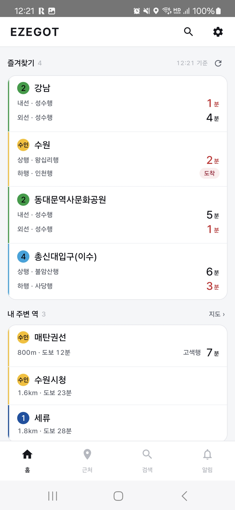
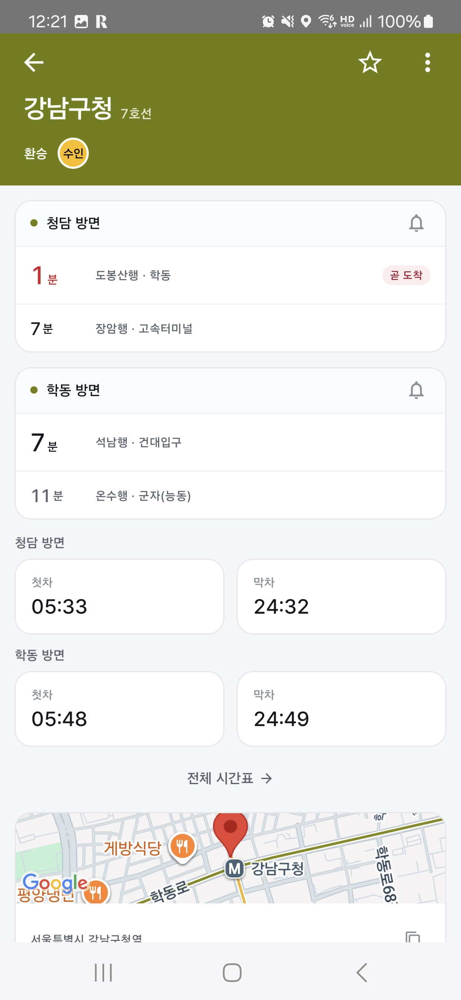
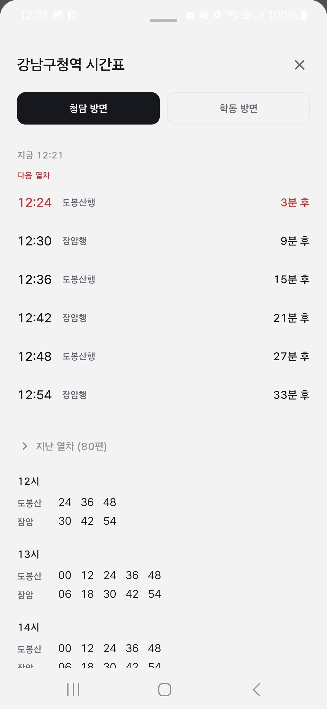
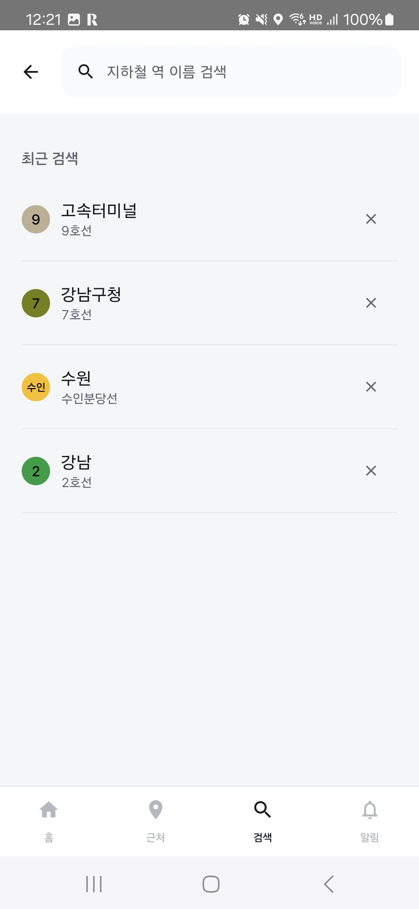
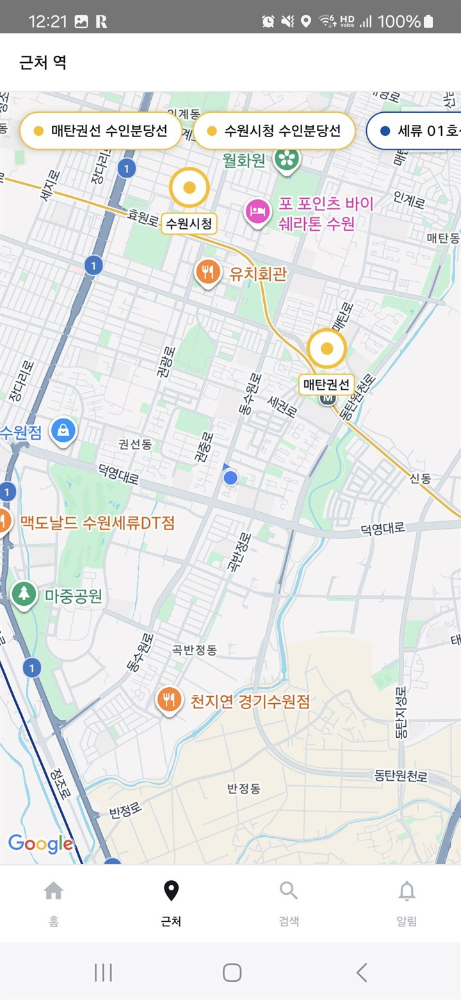

# Ezegot

[](https://github.com/BaekJongHyeok/Ezegot/actions/workflows/android.yml)

서울 지하철 실시간 도착 정보 Android 앱. 즐겨찾기 역의 도착 시간을 홈 화면과 위젯에서 바로 본다.

## 스크린샷

| 홈 | 역 상세 | 전체 시간표 |
|---|---|---|
|  |  |  |
| 즐겨찾기 역의 양방향 도착 시간과 근처 역 | 방향별 도착, 첫차·막차, 환승 노선 | 다음 열차 6편과 시간대별 목록 |

| 검색 | 근처 역 |
|---|---|
|  |  |
| 역 이름 검색과 최근 검색 기록 | 현재 위치 기준 근처 역 지도 |

## 만든 이유

회사에서 지하철 개찰구를 무정차로 통과시키는 측위 SDK를 Java로 개발했다.
게이트 쪽 코드였다. 같은 지하철 도메인을 승객 관점에서 다시 만들어보고 싶었다.

실무 스택은 Java와 MVP였고, Kotlin·Compose·Coroutine을 화면 몇 개짜리 예제가 아니라
실제 API와 백그라운드 갱신이 얽힌 규모에서 다뤄보는 것이 목표였다.

공공 API를 쓰는 앱이라 데이터가 늘 깔끔하게 오지 않는다.
그 응답을 실제로 뜯어보는 과정에서 나온 것들이 이 프로젝트의 대부분이다.

## 주요 기능

- 즐겨찾기 역의 상·하행 도착 시간을 홈에서 한 번에 확인
- 현재 위치 기준 근처 역 목록과 지도 표시
- 역 이름 검색과 최근 검색 기록
- 역 상세: 방향별 도착 정보, 첫차·막차, 하루 전체 시간표, 역 위치
- 열차 도착 N분 전 알림 예약
- 홈 화면 위젯: 즐겨찾기 3개의 양방향 도착 시간, 15분 주기 갱신

## 기술 스택

| 분류 | 사용 | 버전 |
|---|---|---|
| 언어 | Kotlin | 1.9.10 |
| UI | Jetpack Compose, Material3 | Compose BOM 2024.04.01 |
| 화면 이동 | Navigation Compose | 2.7.7 |
| DI | Hilt | 2.51.1 |
| 로컬 DB | Room | 2.6.1 |
| 네트워크 | Retrofit, OkHttp, SimpleXML, Gson | 2.9.0 / 4.12.0 |
| 비동기 | Coroutines, StateFlow | 1.7.3 |
| 위젯 | Glance AppWidget | 1.1.0 |
| 백그라운드 | WorkManager | 2.9.0 |
| 지도·위치 | Maps Compose, Play Services Location | 4.3.3 / 21.3.0 |
| 테스트 | JUnit4, MockK, Turbine | 4.13.2 / 1.13.11 / 1.1.0 |
| 빌드 | AGP, Version Catalog | 8.6.0 |

단일 모듈(`:app`), `compileSdk` 35 / `minSdk` 33 / JVM 17.

## 아키텍처


단방향 흐름이다. Compose 화면은 ViewModel의 `StateFlow`만 구독하고, ViewModel은 Repository를
통해서만 데이터를 얻는다. Repository는 `@Singleton`으로 API 서비스와 DAO를 생성자 주입받고,
네트워크 호출이 실패하면 예외를 던지지 않고 빈 값을 반환한다.

위젯은 Activity를 거치지 않는 별도 진입점이다. `ArrivalWidgetUpdateWorker`가 `@HiltWorker`로
`FavoriteStationDao`와 `SubwayApiService`를 직접 주입받으므로 Repository는 경유하지 않지만,
Hilt가 같은 인스턴스를 주는 덕에 화면과 **같은 Room 인스턴스와 같은 Retrofit 서비스**를 쓴다.
Room은 한때 `AppDatabase` 자체 싱글턴과 Hilt 양쪽에서 만들어져 같은 파일에 인스턴스가 두 개
생겼는데, Worker를 Hilt로 옮기며 생성 경로를 하나로 정리했다.

의존 방향은 반대편으로도 한 줄 있다. `FavoriteRepository`가 즐겨찾기 변경 시
`ArrivalWidget.writeSnapshot()`으로 역 이름을 즉시 기록하고 Worker를 깨운다. 화면에서 별을
누른 결과가 위젯에 바로 반영되어야 하기 때문이다.

도착 시간 정렬·필터 규칙(`util/ArrivalOrdering`)과 강조 판정(`util/ArrivalEmphasis`)은
양쪽이 같은 함수를 쓴다. 같은 열차가 화면과 위젯에서 다른 순서로 보이지 않게 하려는 것이다.

같은 `SubwayApiService` 인터페이스를 서로 다른 `baseUrl`의 Retrofit 인스턴스에 붙여 쓰고
`@Named` 한정자로 구분한다. 실시간 도착 API는 일일 1,000건 제한이 있어 역 이름 단위로
중복 호출을 제거하고 응답을 10초간 인메모리 캐시한다.

## 기술 선택과 근거

### MVVM + 단방향 데이터 흐름
실무에서는 MVP를 도입해 UI와 로직을 분리했다. Presenter가 View 인터페이스를 호출해
화면을 갱신하는 방식이다. Compose는 상태를 받아 그리는 쪽이라 이 구조와 맞물리지 않는다.
역 상세 화면은 StateFlow 7개로 흩어져 있던 상태를 단일 `StationUiState`로 묶었다.
로딩·성공·에러가 한 곳에서 표현되고, 불가능한 조합이 생기지 않는다.

### StateFlow + `stateIn(WhileSubscribed(5_000))`
화면이 보이지 않을 때 수집을 멈춰 불필요한 API 호출을 막는다.
일일 1,000건 제한이 있는 공공 API라 이 부분이 실제 제약이었다.
5초 여유를 둔 것은 화면 회전 같은 짧은 이탈에서 재구독 비용을 피하기 위해서다.

### Hilt
앱과 위젯이 서로 다른 진입점인데 같은 데이터를 봐야 했다.
초기에는 위젯 Worker가 `AppDatabase`의 자체 싱글턴을 따로 쓰고 있어
같은 DB 파일에 Room 인스턴스가 두 개 생성됐다. `@HiltWorker`로 전환해 하나로 합쳤다.

### Repository 반환 규약: 실패 시 빈 값
`runCatching`으로 예외를 삼키고 빈 리스트를 반환하도록 정했다.
호출부가 단순해지는 대신 대가가 있었다. 네트워크 실패와 "열차가 없음"이 화면에서
구분되지 않는다. 막차 이후든 비행기 모드든 똑같이 "정보 없음"이 뜬다.
지금 구조에서는 이 구분이 불가능하고, `Result` 또는 sealed 타입으로 바꿔야 한다.

### Clock 주입
`ArrivalEstimator`가 `Calendar.getInstance()`로 현재 시각을 직접 읽고 있었다.
출퇴근 혼잡 가중치가 실행 시각에 따라 달라져 테스트가 성립하지 않았다.
시각을 주입받도록 바꾸고 고정 시각으로 검증했다.
이 결정 덕분에 CI에서 타임존 버그가 드러났다 — 아래 참조.

### Glance + WorkManager
위젯은 앱이 떠 있지 않아도 갱신돼야 한다.
정확한 시각이 필요한 작업이 아니므로 `AlarmManager` 대신 WorkManager 주기 작업(15분)을 썼다.
Doze 모드에서 시스템이 배터리를 고려해 실행 시점을 조정하도록 맡기는 편이 낫다고 판단했다.

## 검토했지만 쓰지 않은 것

### 다크 테마
위젯이 다크 배경이라 앱도 다크로 통일하는 안을 검토했고, 팔레트를 만들어 적용해봤다.
문제는 화면 코드 213곳이 `MaterialTheme.colorScheme`이 아니라 색 토큰을 직접 참조하고
있었다는 점이다. `darkColorScheme`을 추가해도 화면은 그대로 밝게 남았다.
결국 `colorScheme` 경유로 전부 마이그레이션한 뒤 라이트로 되돌렸다.
다크 자체를 포기한 것이지 구조를 포기한 것은 아니라, 지금은 `Theme.kt` 한 파일만
고치면 다크를 추가할 수 있다.

### 캐러셀
즐겨찾기를 가로 스와이프 카드로 만들었다. 도착 시간을 크게 보여줄 수 있고
호선색 헤더로 구분이 되어 처음에는 나아 보였다.
그런데 호선 아이콘을 원형 픽토그램으로 바꾸고 나니 색 구분은 아이콘이 이미 하고 있었고,
남은 이점은 글자 크기뿐이었다. 세로 스크롤 안의 가로 스와이프는 제스처도 겹친다.
리스트로 되돌리고 도착 시간을 18sp로 올려 그 이점을 회수했다. 세로 점유는 오히려 줄었다.

### 공식 호선 표기 (호선색 원 + 흰 숫자)
서울 지하철 실물 표기를 그대로 쓰려 했으나, 명암비를 계산해보니 9개 노선 중 8개가
4.5:1에 미달했다. 2호선 3.56:1, 3호선 2.77:1, 9호선 2.15:1.
실물 표지판은 조명과 크기가 다른 조건이다. 26dp 원 안의 13sp 숫자에는 그대로 적용되지 않는다.
채움색은 공식 원색을 유지하고 글자색만 배경 휘도로 선택하도록 바꿨다.
읽히지 않는 공식 표기보다 읽히는 비공식 표기가 낫다고 판단했다.

### MVI, Paging3, UseCase 계층, 멀티모듈
MVI는 상태 변경 경로가 복잡하지 않아 Intent·Reducer 계층이 보일러플레이트만 늘린다.
Paging3는 역 목록이 수백 건 규모라 페이징이 필요한 데이터량이 아니다.
UseCase는 도메인 로직이 얇아 Repository를 한 번 더 감싸는 껍데기가 된다.
멀티모듈은 단일 개발자·단일 앱 규모에서 빌드 구성 비용이 얻는 것보다 크다.

## 구현하며 다룬 문제들

공공 API의 응답은 문서에 적힌 대로만 오지 않는다.
아래는 실제 응답을 뜯어보며 발견하고 고친 것 중 일부다.
전체 목록과 커밋·수치는 [docs/findings.md](docs/findings.md)에 정리했다.

### 가장 가까운 열차가 목록에서 사라지고 있었다

`arvlMsg2`에 `"전역 출발"`이 오면 `endsWith("출발")`에 걸려 "출발"로 판정됐고,
정렬 로직이 이미 떠난 열차로 보고 걸러냈다.
그런데 "전역 출발"은 **이전 역을 떠났다**, 즉 이쪽으로 오고 있다는 뜻이다.
가장 먼저 도착할 열차가 화면에서 빠지고 그다음 열차가 첫 줄로 올라오고 있었다.

같은 계열의 문제가 하나 더 있었다. `"전역 도착"`이 `endsWith("도착")`에 걸려
현재 역 도착으로 표시됐다. 한 정거장 떨어진 열차를 "지금 들어온다"고 알린 셈이다.
62건 표본에서 12건(19%)이 이렇게 표시되고 있었다.

`startsWith("전역")` 검사를 뒤 검사보다 앞으로 올려 두 건을 함께 해결했다.
같은 열차를 수원·매교·수원시청 세 역에서 동시에 수집해,
진행 방향을 따라 도착 시간이 단조 증가하는지로 검증했다.

### 표현을 바꾸니 숨어 있던 파싱 오류가 드러났다

도착 상태를 칩으로 감싸자 상태 칩에 "총신대입구"라는 역명이 나타났다.
꼬리에 붙는 `(다음 역)`을 떼려고 쓴 `substringBefore("(")`가
역명에 포함된 괄호에 먼저 걸린 것이었다.

서울 지하철 655개 역 중 67개(10.2%)가 괄호 부제를 단다.
총신대입구(이수), 서울대입구(관악구청), 잠실(송파구청), 왕십리(성동구청) 등
이용객이 많은 환승역이 다수 포함된다.

최초 코드부터 있던 결함인데, 평범한 글자로 렌더될 때는 묻혀 있다가
시각적으로 강조하자 드러났다.

### CI가 아니었으면 못 잡았을 버그

로컬에서는 통과하던 테스트가 CI에서 실패했다.
`recptnDt`(데이터 수신 시각)를 기기 타임존의 `LocalDateTime`으로 읽고 있었는데,
이 값은 타임존 표기가 없고 항상 KST다.
로컬(KST)에서는 우연히 맞았고 CI(UTC)에서 9시간이 어긋났다.

이 필드는 "이미 떠난 열차를 걸러내는" 판정에 쓰인다.
어긋나면 필터가 통째로 무력화된다. 해외에서 앱을 켜도 같은 일이 벌어진다.
`Asia/Seoul`로 고정해 `Instant`로 비교하도록 바꿨다.

CI를 세운 이유는 로컬 빌드 환경이 없는 상태에서 컴파일을 검증하기 위해서였는데,
결과적으로 환경 의존 버그를 잡는 쪽에서 값을 했다.

### 실물 표기를 그대로 쓸 수 없었다

호선 아이콘을 "호선색 원 + 흰 숫자"라는 공식 표기로 만들려 했다.
명암비를 계산해보니 9개 노선 중 8개가 WCAG AA 기준 4.5:1에 미달했다.
2호선 3.56:1, 3호선 2.77:1, 9호선 2.15:1.

실물 표지판은 조명과 크기가 다른 조건이다.
26dp 원 안의 13sp 숫자에는 그대로 적용되지 않는다.
채움색은 공식 원색을 유지하고 글자색만 배경 휘도에 따라 선택하도록 바꿨다.
18개 노선 전부 4.5:1 이상이 되고, 최저는 GTX-A의 4.63:1이다.

## 테스트

단위 테스트 34건. `./gradlew test`로 실행한다.

| 클래스 | 건수 | 다루는 것 |
|---|---|---|
| `RealtimeArrivalTest` | 14 | 도착 메시지 변환. 전역 접두, 역명 괄호 부제, `barvlDt` 우선순위 |
| `ArrivalOrderingTest` | 6 | 도착 순 정렬, 떠난 열차 제외, 방향·노선 필터 |
| `TimeTableScheduleTest` | 4 | 급행 판정. 서울 API의 `D`/`G`, TAGO의 `Y`/`N` |
| `ArrivalEstimatorTest` | 4 | 역 수 기반 소요 시간 추정. 급행 계수, 혼잡 가중치 |
| `StationViewModelTest` | 4 | 역 상세 `UiState` 전이, 즐겨찾기 토글 |
| `SearchRepositoryTest` | 2 | Room 엔티티 변환, 최근 검색 중복 처리 |

외부 API 응답 파싱과 시각 계산에 테스트를 몰아 두었다. 이 두 곳에서 나온 결함이 화면까지
그대로 전달되는데, 화면에서는 원인을 좁히기 어렵기 때문이다. `ArrivalEstimator`와
`ArrivalOrdering`은 `java.time.Clock`을 주입받아 고정 시각으로 검증한다.

## 프로젝트 구조

```
app/src/main/java/com/jonghyeok/ezegot/
├─ MyApplication.kt          HiltAndroidApp, WorkManager Configuration.Provider
├─ SubwayLine.kt             호선 ID ↔ 이름 매핑
├─ alarm/                    SubwayAlarmManager, SubwayAlarmWorker
├─ api/                      Retrofit 인터페이스, 응답 DTO
├─ db/                       Room Entity / DAO / Migrations
├─ di/                       AppModule, ApiKeys
├─ dto/                      도메인 모델
├─ navigation/               NavGraph
├─ repository/               Main, Station, Favorite, Search, Location
├─ ui/
│  ├─ screen/                Home, Search, NearbyMap, Alarm, Splash, MainShell
│  │  └─ station/            역 상세 (헤더 / 도착 카드 / 첫차·막차 / 시간표 시트 / 위치)
│  └─ theme/                 Color, Theme, Type
├─ util/                     ArrivalEstimator, ArrivalOrdering, ArrivalEmphasis
├─ view/                     MainActivity
├─ viewModel/                Main, Station, Search, Alarm, Splash
└─ widget/                   Glance 위젯 + WorkManager 갱신
```

## 빌드 방법

```bash
./gradlew assembleDebug
```

JDK 17이 필요하다.

### API 키 설정

공공 API 키를 소스에 두지 않는다. `local.properties.example`을 `local.properties`로
복사한 뒤 값을 채운다. `local.properties`는 `.gitignore` 대상이다.

| 키 | 발급처 | 용도 |
|---|---|---|
| `SEOUL_OPEN_API_KEY` | [서울 열린데이터광장](https://data.seoul.go.kr) | 전체 역 목록, 실시간 도착 정보 |
| `SEOUL_TIMETABLE_API_KEY` | [서울 열린데이터광장](https://data.seoul.go.kr) | 역별 시간표 (첫차·막차) |
| `TAIMS_API_KEY` | [서울 교통 데이터](https://t-data.seoul.go.kr) | 역 위경도 |
| `DATA_GO_KR_SERVICE_KEY` | [공공데이터포털](https://www.data.go.kr) TAGO_지하철정보 | 시간표 폴백 (코레일 등) |
| `MAPS_API_KEY` | [Google Cloud Console](https://console.cloud.google.com) Maps SDK for Android | 지도 표시 |

```properties
SEOUL_OPEN_API_KEY=발급받은_키
SEOUL_TIMETABLE_API_KEY=발급받은_키
TAIMS_API_KEY=발급받은_키
DATA_GO_KR_SERVICE_KEY=발급받은_Encoding_키
MAPS_API_KEY=발급받은_키
```

**키가 비어 있어도 빌드는 통과한다.** 다만 해당 기능의 조회가 동작하지 않는다.

`DATA_GO_KR_SERVICE_KEY`는 공공데이터포털이 주는 Encoding 키를 그대로 넣는다
(`%2F`, `%2B`, `%3D` 포함). Retrofit이 `encoded = true`로 전달하므로 재인코딩하지 않는다.

### 키 주입 경로

| 대상 | 주입 경로 | 코드에서 읽는 곳 |
|---|---|---|
| 공공 API 키 4종 | `local.properties` → `buildConfigField` → `BuildConfig` | `di/AppModule`의 `provideApiKeys()` 한 곳 |
| `MAPS_API_KEY` | `local.properties` → `manifestPlaceholders` → `AndroidManifest` | 지도 SDK가 매니페스트 `meta-data`에서 직접 읽음 |

`BuildConfig`를 참조하는 코드는 `AppModule` 하나뿐이다. Repository는 키 문자열 대신
`ApiKeys` 객체를 주입받으므로 인증 정보가 데이터 계층 시그니처에 노출되지 않는다.

`MAPS_API_KEY`가 실제로 필요한 것은 Maps SDK for Android 하나다. 위치 조회에 쓰는
`FusedLocationProviderClient`와 주소 변환에 쓰는 `android.location.Geocoder`는
Android 프레임워크 / Play 서비스 API라 이 키를 사용하지 않는다.

## 사용한 외부 리소스

| 리소스 | 라이선스 | 쓰이는 곳 |
|---|---|---|
| [Pretendard](https://github.com/orioncactus/pretendard) Std Variable | SIL Open Font License 1.1 | 앱 전체 본문 서체 |
| [Material Symbols](https://fonts.google.com/icons) `directions_subway` (Rounded, Filled) | Apache License 2.0 | 런처 아이콘 |

라이선스 원문은 `app/src/main/assets/`에 함께 넣어 두었다
(`pretendard_OFL.txt`, `material_symbols_APACHE-2.0.txt`).

## 앞으로 개선할 것

아래는 인지하고 있으나 이번 범위에서 다루지 않은 것들이다.

**일일 API 한도 소진이 화면에 드러나지 않는다.** 실시간 도착 API는 일일 1,000건
제한이 있고, 연속 실패 시 `StationRepository`가 `isApiLocked`로 호출을 멈춘다.
이 상태가 Repository 내부에만 있어 화면으로 올라오지 않는다. 사용자는 도착 정보가
비어 있는 이유를 알 수 없다.

**마지막 조회 결과를 캐시하지 않는다.** 실시간 도착은 역 이름별 10초 인메모리
캐시만 있고 영속 저장이 없다. 네트워크가 없으면 아무것도 보여주지 못한다.

**홈에 네트워크 실패 표시가 없다.** 오류 표시는 역 상세의 첫차·막차 시간표
한 곳에만 있다(`StationUiState.errorMessage`).

**Compose UI 테스트가 없다.** 단위 테스트 34건은 모두 JVM에서 도는 것이고
`androidTest` 소스셋 자체가 없다. 화면 상태 전이는 검증되지 않았다.

**위젯이 크기와 무관하게 3개 고정이다.** Glance `SizeMode.Responsive`를 쓰지 않아
2×2로 줄여도 3개를 그리려 한다.

<!-- 직접 작성할 내용이 있으면 이 위에 덧붙인다 -->
